# firebase2appsheet

#### Note: This is not an official Google Product. This is a demonstration for learning purposes only; it is not meant for a production deployment.

### Overview

- [Google Firestore](https://firebase.google.com/docs/firestore) is a fast, realtime nosql data store which also includes numerous API clients and entry points.

- [Flask](https://flask.palletsprojects.com/en/1.1.x/) is an python, open-source web routing package that can handle all kinds of neat API scenarios.

- Google [Appsheet.com](https://www.appsheet.com) is a SaaS platform for no-code mobile applications.

- [Google Cloud Run](https://cloud.google.com/run) creates production-grade containerized servers from your configured source code.

*This demo/solution combines all four of these elements.*

### Requirements

- Access to Google Cloud and a Google cloud project with billing enabled.
- Access to www.appsheet.com - registration is free.
- A general understanding of Google cloud projects as well as [cloud shell](https://cloud.google.com/shell).

- **If you have never done this particular pipeline before, we recommend [this tutorial](https://cloud.google.com/community/tutorials/building-flask-api-with-cloud-firestore-and-deploying-to-cloud-run) first.**

### Run it standalone

- If for whatever reason, you want to run this flask server on your local machine, here are the quick notes:
	- It's python 3.
	- We make no assumptions about python virtual envs or module support.
	- It's pretty straightforward and should work if you are familar with python.
	- You will need to paste in your key.json file from Google IAM into "misc/key.json" file of this project.

- The default for this example is to run on localhost:8080 and misc/oas.yml refers to this URL. In a later step below, after we deploy to cloud run, we will run a curl command to "init" the instance as well as change the OAS server url to match our new cloud run hostname.

- The rest of these instructions are canned and tutorialized and should work as-is. Please let us know if not.

### High Level Steps - Google Firestore

- Sign up for [Google Firebase](https://console.firebase.google.com/) and create a new project. The project name is up to you - we chose "appsheet-firestore" for our example:

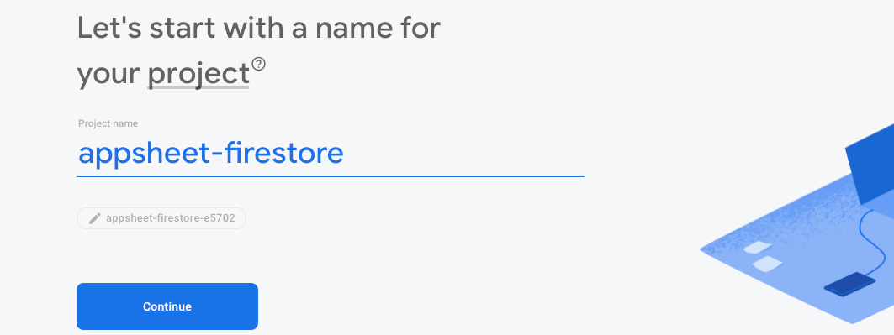

- You can disable google analytics for this demonstration:

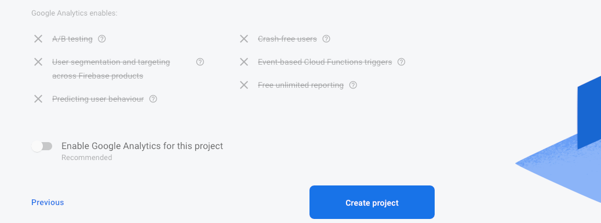

- Once your project is up and running, create a new Firestore Database:

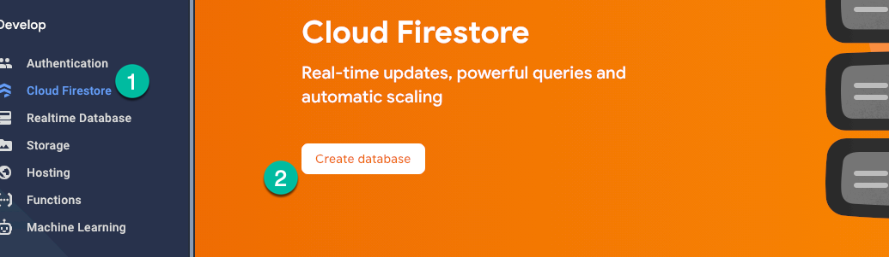

- For security purposes, we recommend Production Mode:

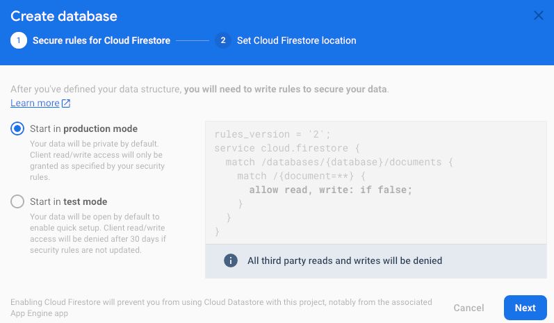

- For Firestore Location, we chose us-central:

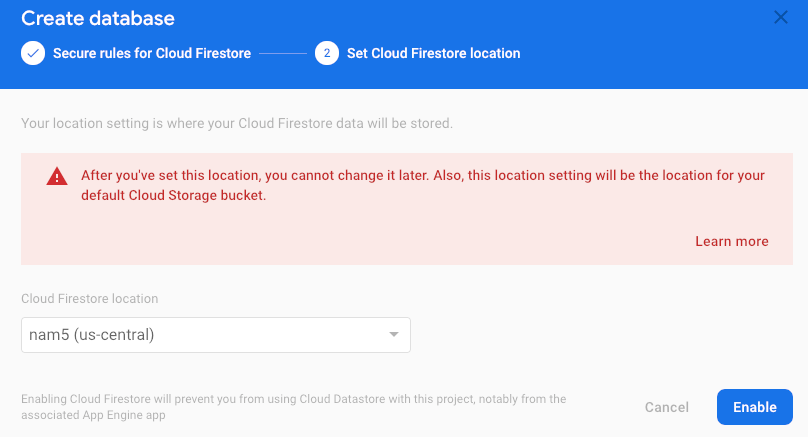

- Once the database is created, click on Project Settings, then Service Accounts. Then click "Generate new private key" and download your JSON file. You will need this json file later:

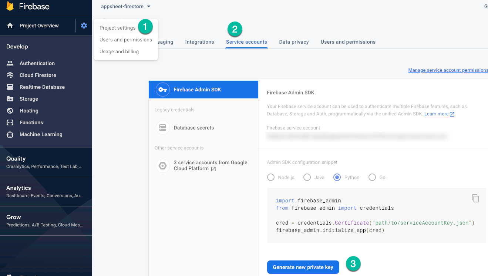

### High Level Steps - Google Cloud Run

- Open a new tab and go to [https://console.cloud.google.com/](https://console.cloud.google.com/). In the steps above, Firestore created a Google Cloud Project for you. Make sure that is selected:

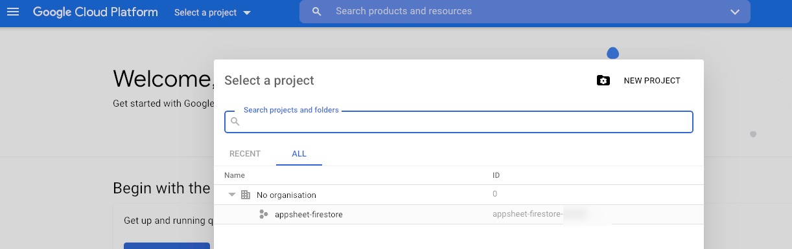

- We need to enabled the Cloud Run API. You can search for this at the top of your project:

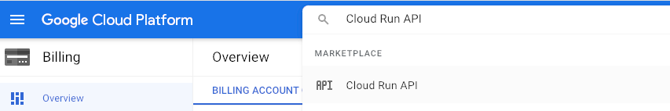

- Enabling this API will take a moment. Once complete, open up the cloud shell. This may take a moment:

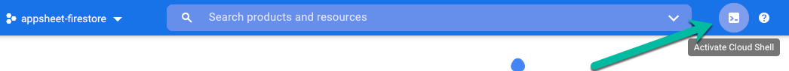

- Download this very github project to your Google cloud shell and also execute a few other commands as follows:
	- `git clone https://github.com/northwestcoder/firebase2appsheet`
	- `cd firebase2appsheet`
	- `echo -n "mylongapikey123890sdflkjw45" > misc/apikey`

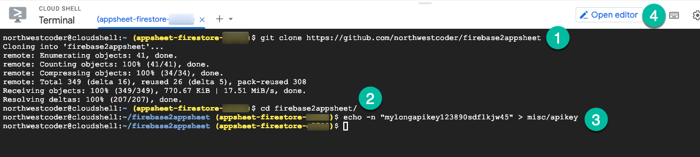

- The last command above creates a new api key for later use in Appsheet. You will need to take note of this key (and you can change the value as desired)

- Next, open up the cloud editor, find the file key.json and paste in the entire contents of the JSON file you downloaded during the Firestore configuration.

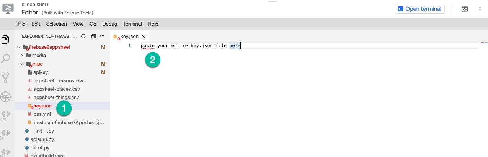

- **Save your changes!** Now go back to cloud shell mode - you will now probably have noted that there is a toggle button between "Open Editor" and "Open Terminal".

- We will need to run cloud build **twice**
	- The first time is to creat the cloud build which gives us a proper DNS and hostname
	- We will then edit our ./misc/oas.yml file and change the URL to this new DNS
	- And then we will run cloud build a second time to update the container.

- Run cloud build the first time
	- You will also be prompted to Authorize Cloud Shell.
	- And, if you have never done this before, you will be prompted to enabled API's and try again:

`gcloud builds submit --config cloudbuild.yaml .`

- Don't forget the trailing "." above. The build will take a few minutes. Cloud run will nicely wrap this python flask server running on http/8080 into a new containerized instance running on https/443. At the end you should see "success" as well as your new hostname:

- Once build is complete, your endpoint is *almost ready* for use by Appsheet (or even postman at this point). Take note of the end point at the very end of the build steps, e.g. it will look something like *https://firebase2appsheet-abcdefe123-uc.a.run.app*. This is our YOURNEW_CLOUDRUN_URL url that we will use below. Also take note of the API key value you created above. 

- At the cloud shell prompt, change YOURNEW_CLOUDRUN_URL to your new url and then run. This will
	- Initialize firestore with some default data, and
	- Modify the oas.yml file, updating the URL reference on line 7 of that file.
	- Notice that you need to substitute your new cloud run URL *twice* in the following command.

`curl -X POST --header "x-apikey: APIKEYFROMABOVESTEP" "YOUNEW_CLOUDRUN_URL/init?oas=YOURNEW_CLOUDRUN_URL"`

So, for example, your curl command might look like:

*curl -X POST --header "x-apikey: mylongapikey123890sdflkjw45" "https://firebase2appsheet-hb3soq3q-uc.a.run.app/init?oas=https://firebase2appsheet-hb3soq3q-uc.a.run.app"*

- If you are an OpenAPI expert, you might now notice that storing our oas.yml inside the server container which is running the endpoints is a brittle way to manage openapi specs. But from a demo perspective or single-deployment perspective, we're ok :) Also if your goal is simply to expose Firestore to Appsheet, then this procedure is also valid for production. 

	- What we are doing above is performing a special one-time POST to our new cloud run instance - which is now dockerized and has a new shiny cloud run url - and using a special endpoint "init" we are then telling it to update its own built-in oas.yml file. This is a strong anti-pattern in a production env but fine for demo purposes.

- OK one more setting to change: In the Cloud Project UX, search for "Cloud Run", and find your newly deployed container. Edit the Cloud Run instance by clicking into it, and then clicking "EDIT & DEPLOY NEW VERSION"
	- In this screen, you need to set minimum instance to 1, and maximum to 3 (or a deliberately low value as we are just testing).
	- By setting minimum to 1, we are in theory forcing a long-lived and long-running instance, so that our OAS spec yaml file will remain the same.

### High Level Steps - Google Appsheet

- Go to www.appsheet.com and create a new Rest API connection ("Apigee") using this endpoint: `https://YOURNEW_CLOUDRUN_URL/oaspec` and using the apikey you configured above - for more information on the rest API connector in Appsheet go [here](https://help.appsheet.com/en/articles/4438873-apigee-data-source).

- We have also provided a [template Appsheet app](https://www.appsheet.com/samples/Companion-app-for-a-github-project-See-About--More-Information?appGuidString=6120ecb5-5f24-4894-940c-a8d8e1b612b7) which is currently using Google Sheets. The premise here is that if you were successful in following all of the instructions above, you can swap out - one by one - each table reference in this template app, from Google Sheets to your newly configured rest API data source. This template app has all of the firestore data structures and REFS between some of them.

- Another route you can take at this point is to use the three provided CSV files in the ./appsheet directory. These are meant to be uploaded *through your appsheet app, and from there will be loaded into firebase*.

- Note that we are not storing any images in Firestore directly. Instead, when you first logged into Appsheet, you chose Google Auth or Microsoft Auth, and we are using those respective storage platforms for any uploaded images.

- You can also download the Appsheet app from the Apple or Google store and run this app on your smartphone. 

- If you have everything working, you can now go back into Firestore admin console, open up the project you created, select "Firestore" and then watch the screen while you use the mobile app. Any changes you make should flash/highlight in the Firestore console. **Congrats!**

### Background

- We use Kaniko build images, check it out [here](https://github.com/GoogleContainerTools/kaniko#kaniko---build-images-in-kubernetes).

- In firebase, we created a simple data model of people, places, things, and events. There is also a special settings table.

- When you run the "/init" endpoint using curl above, it will try to create at least one record for each of these firestore collections:

	- persons
	- places
	- things
	- events
	- contents
	- settings

- Because this example assumes you are connecting with www.appsheet.com, there are thus all kinds of complications that we nicely avoid around oAuth, advanced OpenAPI Spec concepts, nested JSON in firestore, etc, etc.. Appsheet assumes that each firebase collection is a top-level "table" whose documents (children) are all *indentical in structure*. Because of this simplicity, there's a bunch of code-worrying that does *not* have to happen here.

- Appsheet - like a lot of clients - expects a flat table-esque structure. None of these Firestore examples have any nested JSON, and nor should they.

- There's also a secret "heartbeat" setting which defaults to OFF. If set to ON, after 0-5 minutes, the cloud run instance will begin creating Firestore data once every five seconds until it sees that heartbeat is set to OFF. If OFF, the heartbeat checks Firestore every five minutes to see if someone has turned on the setting. Enabling this is left as an exercise for the reader. :)

### How to add your own tables

- You're going to need to dig into the code for this - we've tried to make it somewhat modular. 

- High level ideas here:

	- You'll need to edit oas.yml to reference your new table.
	- You'll want to make a copy of one of the route_*.py files, study it, and reference your new table accordingly.
	- You'll need to modify firebase2appsheet.py to reference your new route_*.py file.
	- You'll want to create an empty collection in Firestore for your data.
	- We might have missed something - please let us know!

- Future TODO: We should be able to code up a kind of flaskian "RouteFactory" which reads the OpenAPI spec at container runtime and generates all of the routes programatically and populates at least one document (row) in Firestore for consumption. Now, all you would need to do is edit your oas.yml file and rebuild the container! Neato...

### How to productionize this Flask server

- We recommend removing all of the heartbeat code - that's just for demo purposes.

- Ditto for the initialization endpoint ("/init") - this is also just for demo purposes.

- We recommend splitting out the oas.yml file *away from* the containerized server.

- You can increase the memory footprint and change other settings of the containerized Cloud Run instance. Learn more [here](https://cloud.google.com/run/docs/configuring/memory-limits).

- For security: for this demo we baked in a file system "apikey" file. Since the goal for this solution is to act as a front end to Appsheet, and since you will be using Appsheet security and authentication in production, it's reasonable to leave this "apikey" solution in place. There are other possibilities here, such as adding python code to read from a google cloud secret, or similar steps.

